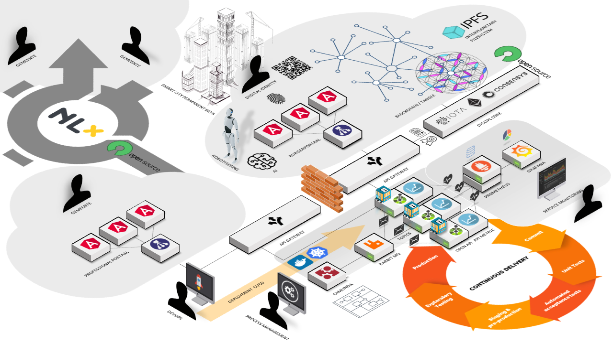
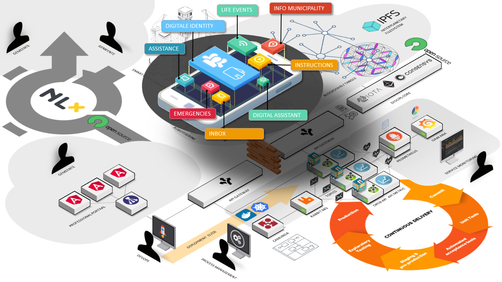
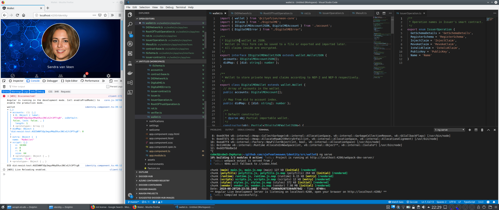

# Wallet

## Citizen Centricity

This wallet is designed to be citizen centric with the social system in mind. Its primary goal is improving the self-reliance of citizens in their municipality.

## Overview

This wallet is part of the following technical eco-system, and is considered to have engouh principles to develop as a common ground.

https://github.com/sjefvanleeuwen/fieldlab-reference-architecture

The wallet lands on this architecture as an APP that is part of a citizens portal, depicted in the following two illustrations:

# Status

Under development, not fit for production use. Creates a DID and wallet for now on NEO Testnet.

# Setting up your environoment

This project was generated with [Angular CLI](https://github.com/angular/angular-cli) version 8.3.0.

## Development server

Run `ng serve` for a dev server. Navigate to `http://localhost:4200/`. The app will automatically reload if you change any of the source files.

## Code scaffolding

Run `ng generate component component-name` to generate a new component. You can also use `ng generate directive|pipe|service|class|guard|interface|enum|module`.

## Build

Run `ng build` to build the project. The build artifacts will be stored in the `dist/` directory. Use the `--prod` flag for a production build.

## Running unit tests

Run `ng test` to execute the unit tests via [Karma](https://karma-runner.github.io).

## Running end-to-end tests

Run `ng e2e` to execute the end-to-end tests via [Protractor](http://www.protractortest.org/).

## Further help

To get more help on the Angular CLI use `ng help` or go check out the [Angular CLI README](https://github.com/angular/angular-cli/blob/master/README.md).
